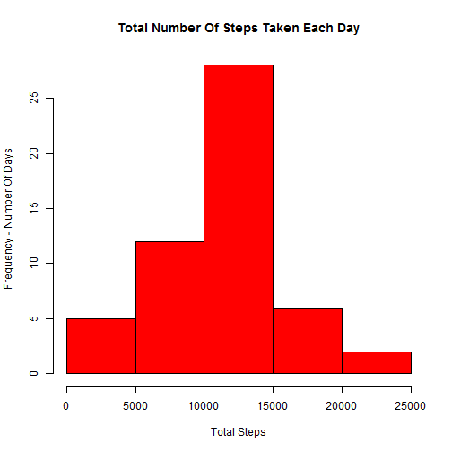
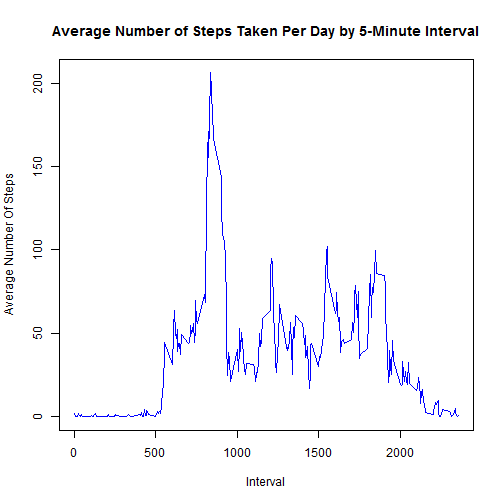
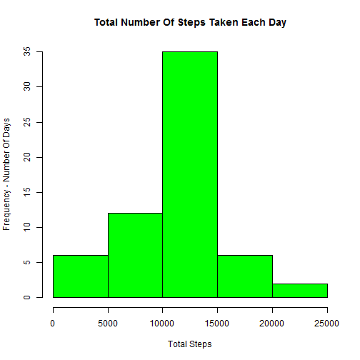
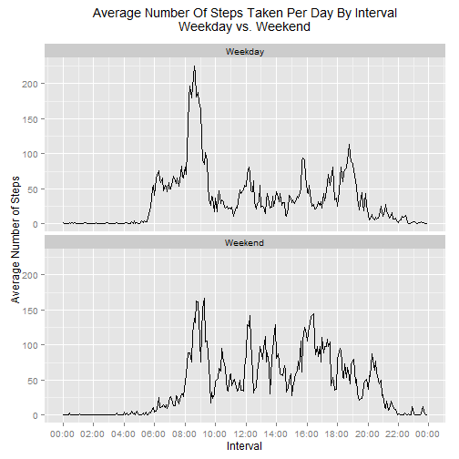

##Introduction

It is now possible to collect a large amount of data about personal movement using activity monitoring devices such as a Fitbit, Nike Fuelband, or Jawbone Up. These type of devices are part of the "quantified self" movement - a group of enthusiasts who take measurements about themselves regularly to improve their health, to find patterns in their behavior, or because they are tech geeks. But these data remain under-utilized both because the raw data are hard to obtain and there is a lack of statistical methods and software for processing and interpreting the data.

This assignment makes use of data from a personal activity monitoring device. This device collects data at 5 minute intervals through out the day. The data consists of two months of data from an anonymous individual collected during the months of October and November, 2012 and include the number of steps taken in 5 minute intervals each day.

##Data

The data for this assignment can be downloaded from the course web site:

Dataset: Activity monitoring data [52K]
The variables included in this dataset are:

steps: Number of steps taking in a 5-minute interval (missing values are coded as NA)

date: The date on which the measurement was taken in YYYY-MM-DD format

interval: Identifier for the 5-minute interval in which measurement was taken

The dataset is stored in a comma-separated-value (CSV) file and there are a total of 17,568 observations in this dataset.

##Assignment

This assignment will be described in multiple parts. You will need to write a report that answers the questions detailed below. Ultimately, you will need to complete the entire assignment in a single R markdown document that can be processed by knitr and be transformed into an HTML file

Throughout your report make sure you always include the code that you used to generate the output you present. When writing code chunks in the R markdown document, always use echo = TRUE so that someone else will be able to read the code. This assignment will be evaluated via peer assessment so it is essential that your peer evaluators be able to review the code for your analysis.

For the plotting aspects of this assignment, feel free to use any plotting system in R (i.e., base, lattice, ggplot2)

Fork/clone the GitHub repository created for this assignment. You will submit this assignment by pushing your completed files into your forked repository on GitHub. The assignment submission will consist of the URL to your GitHub repository and the SHA-1 commit ID for your repository state.

NOTE: The GitHub repository also contains the dataset for the assignment so you do not have to download the data separately.  

##Loading and preprocessing the data

Download Activity Monitoring Dataset using link on Coursera project page to the working directory and unzip (extract) the data files  
Activity Monitoring Data is located at https://d396qusza40orc.cloudfront.net/repdata%2Fdata%2Factivity.zip
NOTE: In order to successfully knit this document, you must call the http:// address and not the https://
Step #1 - Download the zipped file and put it in the "ProjectData1" folder using download.file function - create destinationdirectory if it doesn't already exist  


```r
if(!file.exists("./ProjectData1")){
    dir.create("./ProjectData1")
  }
  fileUrl <- "http://d396qusza40orc.cloudfront.net/repdata%2Fdata%2Factivity.zip"
```

NOTE: download.file(fileUrl,destfile="./ProjectData1/Dataset.zip",method="curl") ===>>> don't need method="curl" on Windows Platform  


```r
download.file(fileUrl,destfile="./ProjectData1/Dataset.zip")
```

Step 2 - Unzip the file using unzip function and use list.files function to show that the unzipped data set (activity.csv) is in the ProjectData folder  


```r
  unzip("./ProjectData1/Dataset.zip", exdir="./ProjectData1")
  list.files("./ProjectData1")
```

```
## [1] "activity.csv" "Dataset.zip"
```

Step 3 - Use the read.csv function to load the data into the work environment as activityData and the str function to see the stats for the new object.  
This shows that the object is a data.frame with 17,568 observations of 3 variables.  
The variables being: steps (type = int), date (type = Factor) and interval (type = int)  
We can also see that the first date for which observations were recorded is 2012-10-01    


```r
activityData <- read.csv("./ProjectData1/activity.csv")
str(activityData)
```

```
## 'data.frame':	17568 obs. of  3 variables:
##  $ steps   : int  NA NA NA NA NA NA NA NA NA NA ...
##  $ date    : Factor w/ 61 levels "2012-10-01","2012-10-02",..: 1 1 1 1 1 1 1 1 1 1 ...
##  $ interval: int  0 5 10 15 20 25 30 35 40 45 ...
```

```r
head(activityData)
```

```
##   steps       date interval
## 1    NA 2012-10-01        0
## 2    NA 2012-10-01        5
## 3    NA 2012-10-01       10
## 4    NA 2012-10-01       15
## 5    NA 2012-10-01       20
## 6    NA 2012-10-01       25
```

##Project Task #1 - What is mean total number of steps taken per day?

For this part of the assignment, you can ignore the missing values in the dataset.  

Step 1.  Calculate the total number of steps taken per day.  
Use the aggregate function and sum function to create object "totalstepsbyday" and use str function to view stats of new object.  
Shows it is a data.frame with 53 observations of 2 variables.  
The variables are: date (type = Factor with 61 levels) and steps (type = int)  


```r
totalstepsbyday <- aggregate(steps ~ date, activityData, sum)
str(totalstepsbyday)
```

```
## 'data.frame':	53 obs. of  2 variables:
##  $ date : Factor w/ 61 levels "2012-10-01","2012-10-02",..: 2 3 4 5 6 7 9 10 11 12 ...
##  $ steps: int  126 11352 12116 13294 15420 11015 12811 9900 10304 17382 ...
```

```r
head(totalstepsbyday)
```

```
##         date steps
## 1 2012-10-02   126
## 2 2012-10-03 11352
## 3 2012-10-04 12116
## 4 2012-10-05 13294
## 5 2012-10-06 15420
## 6 2012-10-07 11015
```

Step 2.  If you do not understand the difference between a histogram and a barplot, research the difference between them. Make a histogram of the total number of steps taken each day


```r
hist(totalstepsbyday$steps, col = "red", main = "Total Number Of Steps Taken Each Day", xlab = "Total Steps", ylab = "Frequency - Number Of Days")
```

 

Step 3.  Calculate and report the mean and median of the total number of steps taken per day.  
Use the mean function to create "meansteps" and median function to create "mediansteps" then display the values in a value report statement


```r
meansteps <- mean(totalstepsbyday$steps)
mediansteps <- median(totalstepsbyday$steps)
```
  
####The mean of the total steps is **1.0766189 &times; 10<sup>4</sup>** and the median of the total steps is **10765**

##Project Task #2 - What is the average daily activity pattern?

1.  Make a time series plot (i.e. type = "l") of the 5-minute interval (x-axis) and the average number of steps taken, averaged across all days (y-axis)  
Use the aggregate function, mean function and "activityData" to create object "avgsteps" and use str function to view stats of new object.  
Shows it is a data.frame with 288 observations of 2 variables.  
The variables are: interval (type = int) and steps (type = num)  


```r
avgsteps <- aggregate(steps ~ interval, activityData, mean)
str(avgsteps)
```

```
## 'data.frame':	288 obs. of  2 variables:
##  $ interval: int  0 5 10 15 20 25 30 35 40 45 ...
##  $ steps   : num  1.717 0.3396 0.1321 0.1509 0.0755 ...
```

```r
head(avgsteps)
```

```
##   interval     steps
## 1        0 1.7169811
## 2        5 0.3396226
## 3       10 0.1320755
## 4       15 0.1509434
## 5       20 0.0754717
## 6       25 2.0943396
```

Then plot the variables to show the Average Number Of Steps Taken Per Day By 5-Minute Interval


```r
plot(avgsteps$interval,avgsteps$steps, type="l", main="Average Number of Steps Taken Per Day by 5-Minute Interval", xlab="Interval", ylab="Average Number Of Steps", col = "blue")
```

 

2.  Which 5-minute interval, on average across all the days in the dataset, contains the maximum number of steps?  


```r
maxstepsinterval <- avgsteps[which.max(avgsteps$steps), 1]
```
  
####The 5-minute interval, on average across all the days in the dataset, that contains the maximum number of steps is interval **835**

##Project Task #3 - Imputing missing values

Note that there are a number of days/intervals where there are missing values (coded as NA). The presence of missing days may introduce bias into some calculations or summaries of the data.

1.  Calculate and report the total number of missing values in the dataset (i.e. the total number of rows with NAs)  
Use the inverse of complete.cases and sum functions to calculate the number of missing values and report results  


```r
incompletedata <- sum(!complete.cases(activityData))
```

####The total number of missing values in the dataset (i.e. the total number of rows with NAs) is **2304**

2.  Devise a strategy for filling in all of the missing values in the dataset. The strategy does not need to be sophisticated. For example, you could use the mean/median for that day, or the mean for that 5-minute interval, etc.  
**The strategy for filling in all missing values in the dataset will be to fill in the missing values with the mean number of steps for the given interval. The mean number of steps per interval was previously calculated and is captured in the data.frame avgsteps.**  

3.  Create a new dataset that is equal to the original dataset but with the missing data filled in.  
**This new dataset will be "imputedmissingvalues" and is verified to contain no missing values**  


```r
imputedmissingvalues <- transform(activityData, steps = ifelse(is.na(activityData$steps), avgsteps$steps[match(activityData$interval, avgsteps$interval)], activityData$steps))
str(imputedmissingvalues)
```

```
## 'data.frame':	17568 obs. of  3 variables:
##  $ steps   : num  1.717 0.3396 0.1321 0.1509 0.0755 ...
##  $ date    : Factor w/ 61 levels "2012-10-01","2012-10-02",..: 1 1 1 1 1 1 1 1 1 1 ...
##  $ interval: int  0 5 10 15 20 25 30 35 40 45 ...
```

```r
head(imputedmissingvalues)
```

```
##       steps       date interval
## 1 1.7169811 2012-10-01        0
## 2 0.3396226 2012-10-01        5
## 3 0.1320755 2012-10-01       10
## 4 0.1509434 2012-10-01       15
## 5 0.0754717 2012-10-01       20
## 6 2.0943396 2012-10-01       25
```

The missing data for the first day (2012-10-01) has been replaced with the interval average which is an overestimation of the data so it is changed to be zero for the first day.  While this may be an underestimation, given that the second day value is only 126 steps, it is not that far off.  


```r
imputedmissingvalues[as.character(imputedmissingvalues$date) == "2012-10-01", 1] <- 0
head(imputedmissingvalues)
```

```
##   steps       date interval
## 1     0 2012-10-01        0
## 2     0 2012-10-01        5
## 3     0 2012-10-01       10
## 4     0 2012-10-01       15
## 5     0 2012-10-01       20
## 6     0 2012-10-01       25
```

Verify that there is no missing data in the new dataset (imputedmissingdata)


```r
verifycompletedata <- sum(!complete.cases(imputedmissingvalues))
verifycompletedata
```

```
## [1] 0
```

Next recalculate the total number of steps taken per day using the new dataset (imputedmissingvalues).  
Use the aggregate function and sum function to create object "newtotalstepsbyday" and use str function to view stats of new object.  
Shows it is a data.frame with 53 observations of 2 variables.  
The variables are: date (type = Factor with 61 levels) and steps (type = int)  


```r
newtotalstepsbyday <- aggregate(steps ~ date, imputedmissingvalues, sum)
str(newtotalstepsbyday)
```

```
## 'data.frame':	61 obs. of  2 variables:
##  $ date : Factor w/ 61 levels "2012-10-01","2012-10-02",..: 1 2 3 4 5 6 7 8 9 10 ...
##  $ steps: num  0 126 11352 12116 13294 ...
```

```r
head(newtotalstepsbyday)
```

```
##         date steps
## 1 2012-10-01     0
## 2 2012-10-02   126
## 3 2012-10-03 11352
## 4 2012-10-04 12116
## 5 2012-10-05 13294
## 6 2012-10-06 15420
```

4.  Make a histogram of the total number of steps taken each day and Calculate and report the mean and median total number of steps taken per day. Do these values differ from the estimates from the first part of the assignment? What is the impact of imputing missing data on the estimates of the total daily number of steps?  
**First create new histogram**  


```r
hist(newtotalstepsbyday$steps, col = "green", main = "Total Number Of Steps Taken Each Day", xlab = "Total Steps", ylab = "Frequency - Number Of Days")
```

 

**Next calculate and report the new mean and median of the total number of steps taken per day using the mean function to create "newmeansteps" and median function to create "newmediansteps" then display the values in a value report statement**


```r
newmeansteps <- mean(newtotalstepsbyday$steps)
newmediansteps <- median(newtotalstepsbyday$steps)
```
  
####The new mean of the total steps is **1.0589694 &times; 10<sup>4</sup>**  
####The new median of the total steps is **1.0766189 &times; 10<sup>4</sup>**  


```r
sumofsteps <- sum(totalstepsbyday$steps)
newsumofsteps <- sum(newtotalstepsbyday$steps)
sumdifference <- newsumofsteps-sumofsteps
meandifference <- newmeansteps-meansteps
mediandifference <- newmediansteps-mediansteps
```
 
###The impact of imputing missing data on the estimates of the total daily number of steps is:   
####-  The new sum of the total steps is **6.4597132 &times; 10<sup>5</sup>** compared to the original sum value of **570608**   
#####-  The total number of steps in the database across all days increased by **7.5363321 &times; 10<sup>4</sup>**   
####-  The new mean of the total steps is **1.0589694 &times; 10<sup>4</sup>** compared to the original mean value of **1.0766189 &times; 10<sup>4</sup>**   
#####-  The mean of the total steps actually decreased by **-176.4948964**   
####-  The new median of the total steps is **1.0766189 &times; 10<sup>4</sup>** compared to the original median value of **10765**  
#####-  The median increased by **1.1886792**   

##Project Task #4 - Are there differences in activity patterns between weekdays and weekends?

For this part the weekdays() function may be of some help here. Use the dataset with the filled-in missing values for this part.

1.  Create a new factor variable in the dataset with two levels - "weekday" and "weekend" indicating whether a given date is a weekday or weekend day.  
First add a variable (type = Factor) to the previously developed imputed dataset (imputedmissingvalues) to identify the type of day (namely weekday or weekend).  Check the stats of the revised imputed dataset to see that the varaible has been created and populated  


```r
weekdays <- c("Monday", "Tuesday", "Wednesday", "Thursday", "Friday")
imputedmissingvalues$type = as.factor(ifelse(is.element(weekdays(as.Date(imputedmissingvalues$date)),weekdays), "Weekday", "Weekend"))
str(imputedmissingvalues)
```

```
## 'data.frame':	17568 obs. of  4 variables:
##  $ steps   : num  0 0 0 0 0 0 0 0 0 0 ...
##  $ date    : Factor w/ 61 levels "2012-10-01","2012-10-02",..: 1 1 1 1 1 1 1 1 1 1 ...
##  $ interval: int  0 5 10 15 20 25 30 35 40 45 ...
##  $ type    : Factor w/ 2 levels "Weekday","Weekend": 1 1 1 1 1 1 1 1 1 1 ...
```

```r
head(imputedmissingvalues)
```

```
##   steps       date interval    type
## 1     0 2012-10-01        0 Weekday
## 2     0 2012-10-01        5 Weekday
## 3     0 2012-10-01       10 Weekday
## 4     0 2012-10-01       15 Weekday
## 5     0 2012-10-01       20 Weekday
## 6     0 2012-10-01       25 Weekday
```

Then calculate the mean value of the steps taken by interval for the imputed dataset including consideration for the day type (type)  


```r
totalstepstaken <- aggregate(steps ~ interval + type, imputedmissingvalues, mean)
str(totalstepstaken)
```

```
## 'data.frame':	576 obs. of  3 variables:
##  $ interval: int  0 5 10 15 20 25 30 35 40 45 ...
##  $ type    : Factor w/ 2 levels "Weekday","Weekend": 1 1 1 1 1 1 1 1 1 1 ...
##  $ steps   : num  2.213 0.4377 0.1702 0.1945 0.0973 ...
```

```r
head(totalstepstaken)
```

```
##   interval    type      steps
## 1        0 Weekday 2.21299790
## 2        5 Weekday 0.43773585
## 3       10 Weekday 0.17023061
## 4       15 Weekday 0.19454927
## 5       20 Weekday 0.09727463
## 6       25 Weekday 1.54381551
```

2.  Make a panel plot containing a time series plot (i.e. type = "l") of the 5-minute interval (x-axis) and the average number of steps taken, averaged across all weekday days or weekend days (y-axis). See the README file in the GitHub repository to see an example of what this plot should look like using simulated data.  
Library the ggplot2 to support creation of the panel plot  


```r
library(ggplot2)
library(scales)
```

Create panel plot containing a time series plot (i.e. type = "l") of the 5-minute interval (x-axis) and the average number of steps taken, averaged across all weekday days or weekend days (y-axis).  


```r
ggplot(totalstepstaken, aes(strptime(sprintf("%04d", interval), format="%H%M"), steps)) + geom_line() + facet_wrap(~ type, ncol=1) + xlab("Interval") + scale_x_datetime(labels = date_format("%H:%M"),  breaks = date_breaks("2 hour")) + scale_y_continuous("Average Number of Steps") + theme(plot.title = element_text(vjust=2)) + ggtitle("Average Number Of Steps Taken Per Day By Interval\nWeekday vs. Weekend")
```

 

